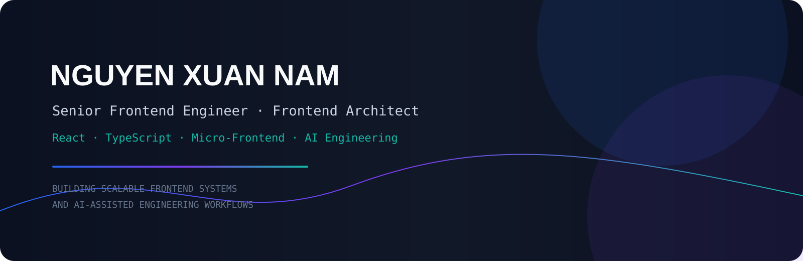

# 👋 Nguyễn Xuân Nam

<p align="center">
  
</p>

<p align="center">
  
</p>

<p align="center">
  <strong>Building scalable frontend systems, developer platforms, and AI-assisted engineering workflows.</strong>
</p>

<p align="center">
  <a href="https://github.com/namnx-vn">
    
  </a>
  <a href="https://www.linkedin.com/in/nam-nguyen-xuan-a71a78219/">
    
  </a>
</p>

---

## Engineering profile

I work at the intersection of **frontend architecture**, **platform engineering**, and **applied AI for software engineering**.

My strongest areas are:

- React, TypeScript, Next.js, and frontend platform design
- Micro-Frontend architecture and Module Federation
- Design systems, shared libraries, and ownership boundaries
- Frontend performance and measurable Web Vitals optimization
- Static analysis, code quality automation, and CI/CD
- AI-assisted code review and repository-aware developer tooling
- System design with emphasis on reliability, evolvability, and developer experience

```text
Product requirements
        │
        ▼
Domain boundaries ──► Runtime architecture ──► Data flow
        │                                      │
        ▼                                      ▼
Team ownership                           Reliability
        │                                      │
        └────────► Performance ◄───────────────┘
                         │
                         ▼
               Delivery + Observability
                         │
                         ▼
                 Developer Experience
```

---

## Flagship project

### [`ai-reviewer-widget`](https://github.com/namnx-vn/ai-reviewer-widget)

An AI-assisted code review platform designed as more than an LLM wrapper. It combines deterministic analysis with optional AI review and GitHub pull-request automation.

**Current engineering scope**

- TypeScript / JavaScript AST analysis
- Architecture and Micro-Frontend boundary checks
- React semantic analysis and rule engines
- Security intelligence and taint-flow analysis
- Interprocedural and supply-chain analysis
- Performance intelligence
- AI provider abstraction and normalized findings
- GitHub PR retrieval, checks, and review output
- Vitest, Playwright, ESLint, and TypeScript quality gates

```text
Pull Request
    │
    ▼
Deterministic Analysis
    ├── AST / Code Quality
    ├── Architecture
    ├── React
    ├── Security
    └── Performance
    │
    ▼
Optional AI Review
    │
    ▼
Aggregation + Scoring + Decision
    │
    ▼
GitHub Check / PR Feedback
```

> The goal: make code review more explainable, repeatable, architecture-aware, and useful before AI is asked to reason about the change.

---

## Engineering focus

| Area | What I optimize for |
|---|---|
| Frontend architecture | Clear boundaries, explicit contracts, independent evolution |
| React / TypeScript | Predictable state, maintainable APIs, type-safe composition |
| Micro-Frontend | Team autonomy without accidental runtime coupling |
| Design systems | Consistency, accessibility, ownership, scalable adoption |
| Performance | Profiling, Core Web Vitals, bundle/runtime efficiency |
| AI engineering | Deterministic-first workflows, useful context, verifiable output |
| Quality | Static analysis, tests, CI/CD, automated quality gates |
| Developer experience | Fast feedback, strong defaults, less repetitive work |

### Architecture principles

1. **Boundaries before abstractions**
2. **Explicit contracts over implicit coupling**
3. **Local ownership over unnecessary global state**
4. **Shared code requires clear ownership**
5. **Measure before optimizing**
6. **Automate repetitive engineering work**
7. **Prefer reversible decisions**

---

## Tech stack

### Frontend


### Architecture & tooling


`Module Federation` · `Micro-Frontend` · `Design Systems` · `Vitest` · `Jest` · `Playwright` · `ESLint` · `CI/CD` · `MCP` · `AI Agents` · `Static Analysis`

---

## Public work

The profile focuses on repositories that are currently public and verifiable on GitHub.

| Repository | Area |
|---|---|
| [`ai-reviewer-widget`](https://github.com/namnx-vn/ai-reviewer-widget) | AI code review, static analysis, React/security/performance intelligence |
| [`DeepTutor`](https://github.com/namnx-vn/DeepTutor) | AI / LLM exploration |
| [`multica`](https://github.com/namnx-vn/multica) | Software engineering project |
| [`andrej-karpathy-skills`](https://github.com/namnx-vn/andrej-karpathy-skills) | AI engineering study / skills |
| [`awesome-llm-apps`](https://github.com/namnx-vn/awesome-llm-apps) | LLM application exploration |

<p align="center">
  <a href="https://github.com/namnx-vn?tab=repositories"><strong>Explore all public repositories →</strong></a>
</p>

---

## How I think about frontend systems

### Micro-Frontend

```text
                         Host
                          │
          ┌───────────────┼───────────────┐
          │               │               │
     Authentication    Routing         Shell
          │               │               │
          └───────────────┼───────────────┘
                          │
              ┌───────────┼───────────┐
              ▼           ▼           ▼
           Remote A    Remote B    Remote C
              │           │           │
              └───────────┼───────────┘
                          ▼
                    Shared Platform
```

The important part is not splitting the UI into many repositories. It is preserving **ownership, contracts, independent delivery, failure isolation, and version compatibility**.

### Performance

I prefer measurable optimization over subjective tuning:

`LCP` · `INP` · `CLS` · `FCP` · bundle size · JavaScript execution · network waterfall · cache behavior · rendering profiles

### AI-assisted engineering

```text
Repository + Requirements + Architecture Context
                     │
                     ▼
             Context Builder
                     │
          ┌──────────┴──────────┐
          ▼                     ▼
 Deterministic Rules        AI Reasoning
          │                     │
          └──────────┬──────────┘
                     ▼
             Verifiable Output
```

I am most interested in AI workflows where the model is surrounded by strong deterministic checks, useful repository context, and outputs that engineers can verify.

---

## GitHub activity

<p align="center">
  
</p>

<p align="center">
  
</p>

<p align="center">
  
</p>

### Contribution snake

<p align="center">
  <picture>
    <source media="(prefers-color-scheme: dark)" srcset="./assets/github-contribution-grid-snake-dark.svg" />
    <source media="(prefers-color-scheme: light)" srcset="./assets/github-contribution-grid-snake.svg" />
    
  </picture>
</p>

---

## Engineering philosophy

> **Build systems that make the next engineer faster.**

Good engineering is not only about producing code. It is about creating systems that are understandable, maintainable, observable, testable, performant, and able to evolve without unnecessary friction.

<p align="center">
  <a href="https://github.com/namnx-vn">
    
  </a>
  <a href="https://www.linkedin.com/in/nam-nguyen-xuan-a71a78219/">
    
  </a>
</p>

<p align="center">
  <strong>Nguyễn Xuân Nam</strong><br />
  Senior Frontend Engineer · Frontend Architect · AI Engineer
</p>
